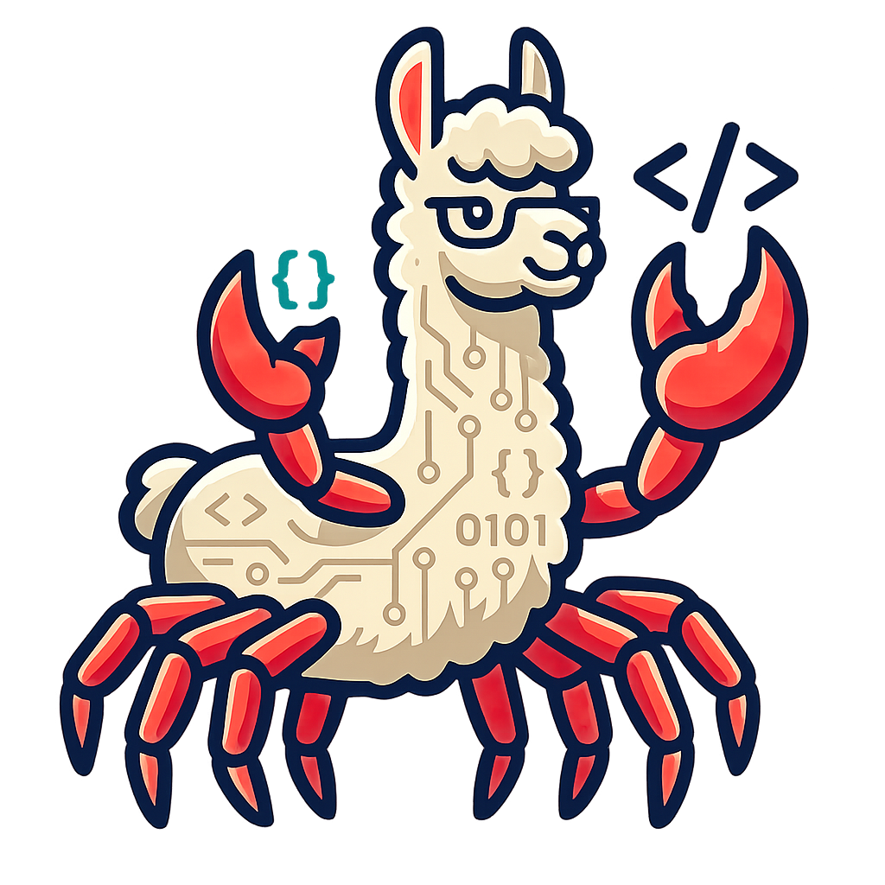

# wwama

`wwama` is a small Rust wrapper crate around a local `llama.cpp` checkout. It is intended to make the `llama.cpp` C API available to Rust code on native targets and browser-oriented WebAssembly targets, including both `wasm32-unknown-unknown` and `wasm64-unknown-unknown`.

The crate exposes both the low-level pieces needed for direct `llama.cpp` access and a small safe session API for Starla provider work:

- building `llama.cpp` as static libraries from Cargo;
- exposing raw FFI bindings for the relevant `llama.h` APIs;
- providing lightweight RAII wrappers for backend, model, context, and batch lifetimes;
- loading GGUF models into a `Session`;
- tokenizing, detokenizing, applying chat templates, generating text, streaming generated token pieces, and producing embedding vectors;
- evaluating selected final-position logits with a clean context;
- inventorying native model tensors and transferring validated byte ranges through their GGML backend;
- extracting Q1_0 row scales and applying reversible packed-bit row XOR mutations;
- supporting WebGPU-enabled Emscripten builds for WebAssembly;
- avoiding `llama.cpp` examples, tools, and server targets.

## Status

This is an early integration crate. The high-level API is intentionally narrow and text-oriented: it owns common batching, prompt evaluation, simple sampling, and L2-normalized embedding extraction, while callers still own model selection, model file distribution, and prompt policy.

## API Sketch

```rust
let mut session = wwama::Session::load_from_path(
    "/models/model.gguf",
    wwama::SessionOptions {
        embeddings: true,
        pooling_type: wwama::llama_pooling_type::Mean,
        ..wwama::SessionOptions::default()
    },
)?;

let output = session.generate_text("user: hello\nassistant:", &Default::default())?;
let embedding = session.embed_text("search text", &Default::default())?;
```

For streaming, use `Session::stream_text(...)` with a token-piece callback. The raw `Model`, `Context`, `Batch`, and `raw::*` surfaces remain available for adapters that need lower-level control.

## Mutable Model Tensors

Tensor inventory is available from `Model::tensors()` and `Model::tensor()` on
native targets. Writes and Q1_0 row mutation require an explicit mutable load:

```rust
let mut session = wwama::Session::load_from_path(
    "/models/model.gguf",
    wwama::SessionOptions {
        mutable_tensors: true,
        ..wwama::SessionOptions::default()
    },
)?;

let descriptor = session.model().tensor("blk.0.ffn_gate.weight")?;
let scales = session.q1_0_row_scales(&descriptor.name)?;
session.xor_q1_0_row(&descriptor.name, 0)?;
session.xor_q1_0_row(&descriptor.name, 0)?; // restores the original row
```

`mutable_tensors` disables read-only model mmap so weights reside in writable
backend storage. This increases model load time and resident memory. Mutation
methods require `&mut Session`, synchronize the context around transfers, and
do not expose GGML tensor pointers. The Q1_0 operation validates a two-dimensional
matrix with 128 values and 18 bytes per block, preserves each FP16 scale, and
inverts only the 16 packed weight bytes.

WebAssembly tensor mutation is deliberately unsupported until an Emscripten or
WebGPU runtime fixture demonstrates correct transfer and visibility semantics.
The `tensor_inventory` example prints names, types, dimensions, strides, byte
sizes, and backend storage. The `miyagi_backend` example demonstrates the
Bankai-facing load, architecture mapping, row-scale, logit-gap, flip, revert,
and generation contract without putting architecture-specific names in wwama.

## Repository Layout

By default, `wwama` expects this layout:

```text
apothic-monorepo/
  libs/
    cpp/
      llama.cpp/
    rust/
      wwama/
```

The default `build.rs` lookup first checks `../../cpp/llama.cpp` from the crate root. It also supports a sibling `../llama.cpp` checkout for standalone development. Override either layout with:

```sh
WWAMA_LLAMA_CPP_DIR=/path/to/llama.cpp cargo build
```

## Build Requirements

Native builds require:

- Rust 1.95 or newer;
- CMake;
- a C++ toolchain compatible with `llama.cpp`.

WebAssembly builds require:

- the `wasm32-unknown-unknown` Rust target for wasm32 builds;
- `rust-src` plus `cargo -Zbuild-std=core,alloc` for wasm64 builds;
- Emscripten SDK for building the `llama.cpp` C/C++ libraries;
- EMDawnWebGPU when building with the default `webgpu` feature.

The build script searches for Emscripten in this order:

- `WWAMA_EMSCRIPTEN_TOOLCHAIN_FILE`;
- `WWAMA_EMSDK`;
- `EMSDK`;
- `$HOME/emsdk`;
- `$HOME/Code/emsdk`.

The build script searches for EMDawnWebGPU using `WWAMA_EMDAWNWEBGPU_DIR` first. Set it explicitly when building outside this workstation.

## Build Commands

Native:

```sh
cargo build
```

Native CUDA, when the host has a compatible CUDA toolkit:

```sh
CUDA_HOME=/usr/local/cuda-13.2 \
CUDA_PATH=/usr/local/cuda-13.2 \
CUDAToolkit_ROOT=/usr/local/cuda-13.2 \
WWAMA_CMAKE_CUDA_ARCHITECTURES=89 \
cargo build --no-default-features --features "std cuda"
```

WASM32 with WebGPU, using the default features:

```sh
rustup target add wasm32-unknown-unknown
cargo build --target wasm32-unknown-unknown
```

WASM64 with WebGPU:

```sh
rustup component add rust-src
RUSTC_BOOTSTRAP=1 cargo build -Zbuild-std=core,alloc --target wasm64-unknown-unknown
```

The crate intentionally keeps the default Rust surface `no_std + alloc` so both wasm32 and wasm64 can build through the same API. The wasm64 target currently needs `build-std` because the toolchain does not ship prebuilt `core` for `wasm64-unknown-unknown`.

CPU-only WASM builds are available by disabling default features:

```sh
cargo build --no-default-features --target wasm32-unknown-unknown
RUSTC_BOOTSTRAP=1 cargo build -Zbuild-std=core,alloc --no-default-features --target wasm64-unknown-unknown
```

## Features

- `webgpu` is enabled by default. For WebAssembly targets, it enables `GGML_WEBGPU=ON` in the `llama.cpp` CMake build.
- `cuda` enables the native llama.cpp/ggml CUDA backend. It is intentionally
  not a default feature.
- `vulkan` enables the native llama.cpp/ggml Vulkan backend. It is intentionally
  not a default feature and requires a Vulkan SDK with `glslc`.
- `std` enables the standard library error trait implementation. The session API itself stays available without `std`.
- Native builds compile the CPU path unless an explicit native GPU backend
  feature is enabled. At runtime, `n_gpu_layers` controls whether llama.cpp
  offloads model layers to a compiled GPU backend.

## License

Licensed under the Apache License, Version 2.0. See [LICENSE](LICENSE).
